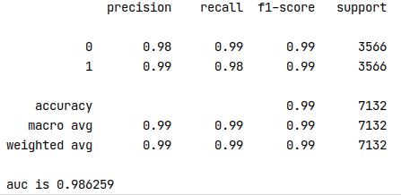

# Can I have my bike back?
## dataset
[Dataset](https://data.torontopolice.on.ca/datasets/TorontoPS::bicycle-thefts/about) is from Toronto Police Service. Details can be found there.
## workflow
1. ### preprocessing
some columns are dropped because of duplicate info or poor quality

features such as season, speed tier, and time scope are generated based on related columns

to evaluate the interpretability of each feature, feature importance and sharply value are adopted. using different methods to measure is the way to cross compare for a comprehensive and integral evaluation

all plots depicted by feature importance and sharply value indicate weak contributions for season, speed tier, and time scope

2. ###modeling

features after the processing feed to the model. records in 2019 are split as test set. catboost is suggested in this context. here is the metric

the model seems to well fit data, but the model decay might be inevitable because of insufficient and unbalanced training set
## highlight
1. KNNImputer is always better than simply filling with mean, median or even dropping null values

2. non-linear correlation needs to be examined because the Pearson correlation coefficient matrix cannot tell you that

3. ADASYN is one of the effective method to resolve unbalanced samples